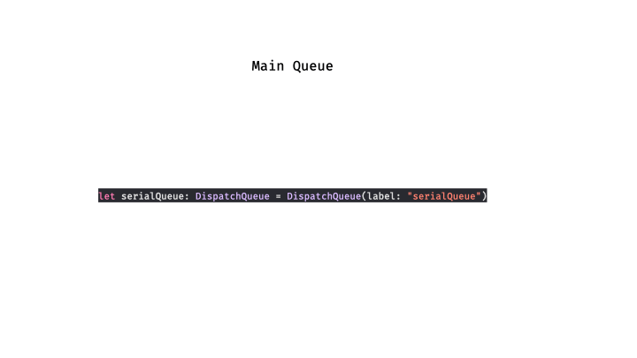
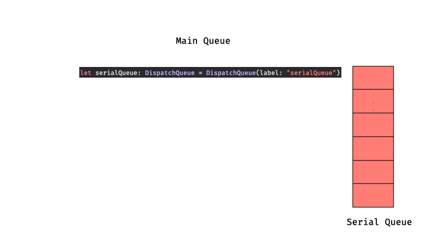
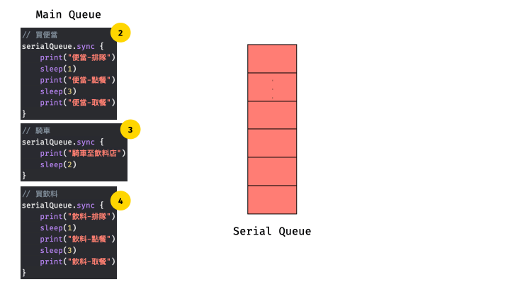
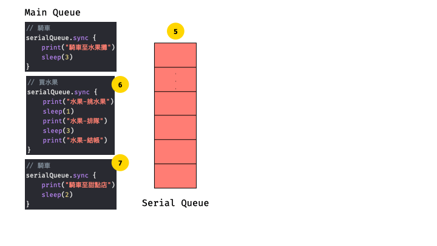
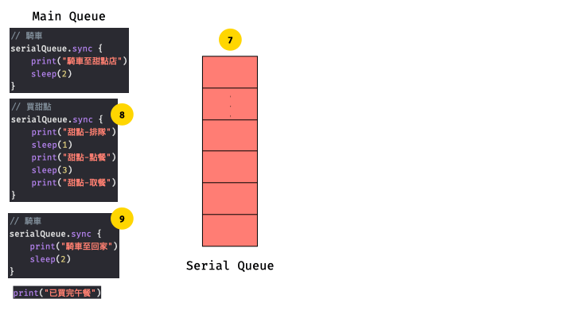
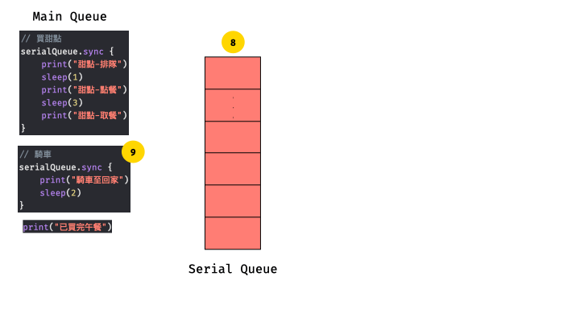
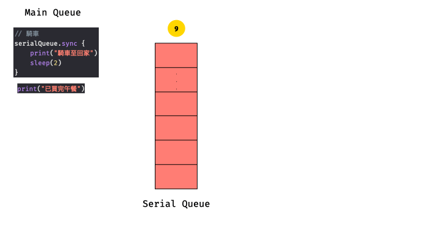
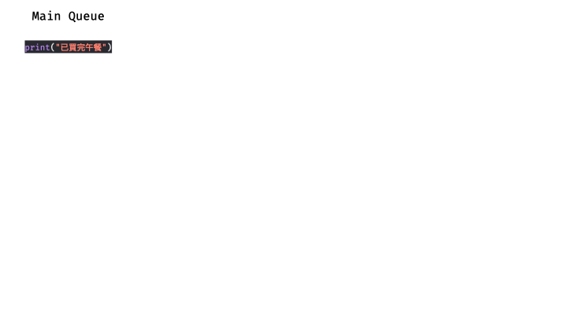

# Example - Serial Queue with Sync

## 購買午餐
- 購買清單：便當 + 飲料 + 水果 + 甜點(各別在不同店)
- 取餐方式：自己騎車到店，拿到餐點再往下間店購買
- task：
  1. 騎車 
  2. 買便當(排隊>點餐>取餐) 
  3. 騎車 
  4. 買飲料(排隊>點餐>取餐) 
  5. 騎車 
  6. 買水果(挑水果>排隊>結帳) 
  7. 騎車 
  8. 買甜點(排隊>點餐>取餐) 
  9. 騎車
- 程式： ``請參閱ViewController中serialQueueSync方法``
- 解析

一、建立Queue   

二、騎車至便當店  

三、買便當

四、騎車至飲料店

五、買飲料

六、騎車至水果店

七、買水果

八、騎車至甜點店

九、買甜點

十、騎車回家

十一、結束

  
