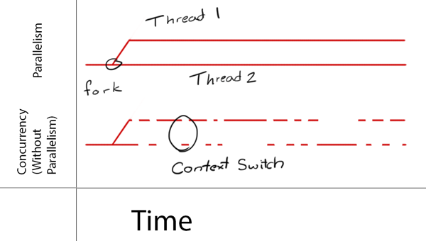
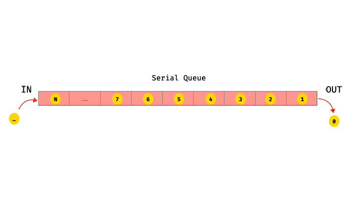
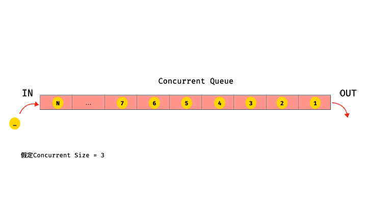
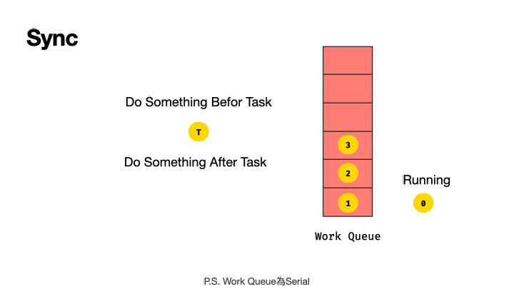
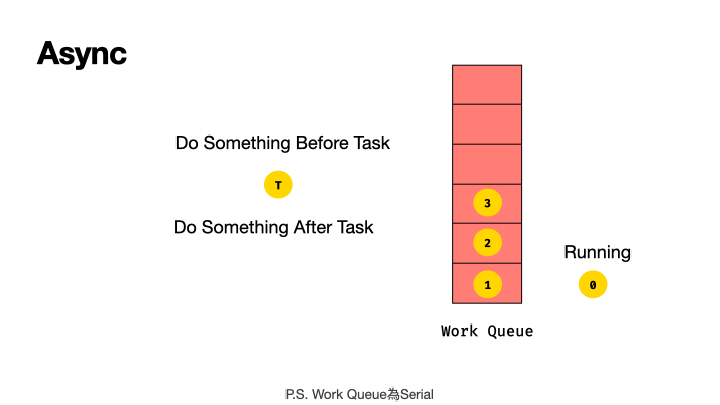

# iOS 多工運作流程與應用

iOS實現多工作業常用方式：
- GCD(Grand Central Dispatch) - 以C語言開發的底層API
- Operation - 將task封裝成Operation物件，再將operation放到OperationQueue中，再依狀況取出task執行

---

## GCD

### Concurrency(平行) vs Parallelism(並行)

圖片來源：[https://www.raywenderlich.com/5370-grand-central-dispatch-tutorial-for-swift-4-part-1-2](https://www.raywenderlich.com/5370-grand-central-dispatch-tutorial-for-swift-4-part-1-2)

- Concurrency：透過作業系統schdule，利用時間差執行task
- Parallelism：同時執行task
> Note that GCD decides how much parallelism it requires based on the system and available system resources. It’s important to note that parallelism requires concurrency, but concurrency does not guarantee parallelism

iOS Queue種類
- main: Serial Queue
- global: Concurrent Queue
- custom: 自行建立與管理，開發者依需求自行決定Serial Queue或Concurrent Queue

### serial vs concurrent
- serial：一次只能執行一個task，可知執行順序

- concurrent：一次可以執行多個task，無法預測執行順序

### sync(同步) vs async(非同步) - 將task放入Work Queue後如何處理這個task
- sync
  - 等待task執行完成後才離開
  - blocking(阻塞)，結束前程式不會往下執行

- async
  - task放入work queue後就離開
  - not blocking(不阻塞)，不等待task直接往下執行程式

### 範例
- Serial Queue with Sync
- Coucurecy Queue with Sync
- Serial Queue with Async
- Coucurecy Queue with Async

### DispatchGruop

### DispatchSem

---
## Operation + OperationQueue
> Operations are an object-oriented way to encapsulate work that you want to perform asynchronously. Operations are designed to be used either in conjunction with an operation queue or by themselves

- 可依需求隨時取消或中斷執行的作業
- 重新封裝，寫法較優雅
- 僅能以concurrent運作
  - 雖然沒有serial模式，但可以籍由task間設定dependency達到serial效果
- task執行後就被移除
- Operation 
  - 抽象類別，必須實作這個類別才可以放入OperationQueue
  - 加入的task以sync方式執行
    - 想要達到async效果就必須切成多個Operation放入OperationQueue，由OperationQueue取出執行
  - Cocoa/Cocoa Touch Framework已實作兩個Operation子類別，讓開發人員可以自行使用
    - BlockOperation：可以建立一個或多個block, 當全部Black的都執行完才視為任務完成
    - InvocationOperation：可用於執行指定對象的選擇器(Selector)，swift無此類別

          let operationQueue = OperationQueue()
          let blockOperation = BlockOperation()
          blockOperation.addExecutionBlock {
              // something...
          }
          operationQueue.addOperation(blockOperation)

---
## 參考資料
  - [Swift 3學習指南：重新認識GCD應用](https://www.appcoda.com.tw/grand-central-dispatch/)
  - [Swift - GCD 多執行緒的說明與應用](https://medium.com/@mikru168/ios-gcd多執行緒的說明與應用-c69a68d01da1)
  - [Grand Central Dispatch Tutorial for Swift 4: Part 1/2
  ](https://www.raywenderlich.com/5370-grand-central-dispatch-tutorial-for-swift-4-part-1-2)
  - [Concurrency in Swift (Grand Central Dispatch Part 1)](https://medium.com/@aliakhtar_16369/concurrency-in-swift-grand-central-dispatch-part-1-945ff05e8863)
  - [GCD和Operation/OperationQueue 看这一篇文章就够了 - Zhihui Tang - Medium](https://medium.com/@crafttang/gcd和operation-operationqueue-看这一篇文章就够了-f38d50521543)
  - [NSOpertation 與 NSOperationQueue](https://zonble.gitbooks.io/kkbox-ios-dev/threading/nsoperation_and_nsoperationqueue.html)
  - [iOS 並行程式設計: 初探 NSOperation 和 Dispatch Queues](https://www.appcoda.com.tw/ios-concurrency/)
  - [Concurrency in Swift (Operations and Operation Queue Part 3)](https://medium.com/@aliakhtar_16369/concurrency-in-swift-operations-and-operation-queue-part-3-a108fbe27d61)