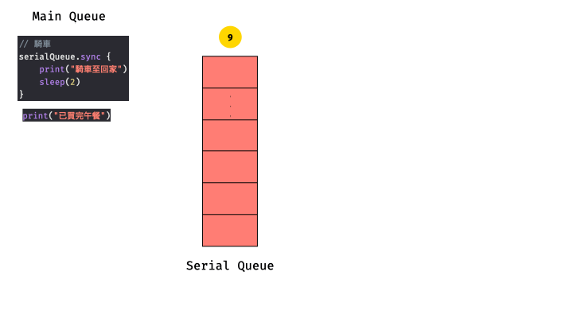

# iGCD

iOS實現多工作業的方式：
- GCD(Grand Central Dispatch) - 以C語言開發的底層API
- Operation - 將task封裝成Operation物件，再將operation放到OperationQueue中，再依狀況取出task執行

---

## GCD

### Concurrency(平行) vs Parallelism(並行)

圖片來源：[https://www.raywenderlich.com/5370-grand-central-dispatch-tutorial-for-swift-4-part-1-2](https://www.raywenderlich.com/5370-grand-central-dispatch-tutorial-for-swift-4-part-1-2)

- Concurrency：透過作業系統schdule，利用時間差執行task
- Parallelism：同時執行task
> Note that GCD decides how much parallelism it requires based on the system and available system resources. It’s important to note that parallelism requires concurrency, but concurrency does not guarantee parallelism

### sync vs async
- sync：等待task執行完成後才離開，blocking(阻塞)，結束前程式不會往下執行
- async：task放入佇列後就離開，not blocking(不阻塞)，不管程式結果如何，直接執行下一行程式

### serial vs concurrent
- serial：一次只能執行一個task
- concurrent：一次可以執行多個task

### 範例

#### 購買午餐 - 採Serial Queue & Sync
- 購買清單：便當 + 飲料 + 水果 + 甜點(各別在不同店)
- 取餐方式：自己騎車到店，拿到餐點再往下間店購買
- task：
  1. 騎車 
  2. 買便當(排隊>點餐>取餐) 
  3. 騎車 
  4. 買飲料(排隊>點餐>取餐) 
  5. 騎車 
  6. 買水果(挑水果>排隊>結帳) 
  7. 騎車 
  8. 買甜點(排隊>點餐>取餐) 
  9. 騎車
- 程式

      // 建立serial queue
      let serialQueue: DispatchQueue = DispatchQueue(label: "serialQueue")

      // 騎車
      serialQueue.sync {
          print("騎車至便當店")
          sleep(5)
      }

      // 買便當
      serialQueue.sync {
          print("便當-排隊")
          sleep(1)
          print("便當-點餐")
          sleep(3)
          print("便當-取餐")
      }

      // 騎車
      serialQueue.sync {
          print("騎車至飲料店")
          sleep(2)
      }

      // 買飲料
      serialQueue.sync {
          print("飲料-排隊")
          sleep(1)
          print("飲料-點餐")
          sleep(3)
          print("飲料-取餐")
      }

      // 騎車
      serialQueue.sync {
          print("騎車至水果攤")
          sleep(3)
      }

      // 買水果
      serialQueue.sync {
          print("水果-挑水果")
          sleep(1)
          print("水果-排隊")
          sleep(3)
          print("水果-結帳")
      }

      // 騎車
      serialQueue.sync {
          print("騎車至甜點店")
          sleep(2)
      }

      // 買甜點
      serialQueue.sync {
          print("甜點-排隊")
          sleep(1)
          print("甜點-點餐")
          sleep(3)
          print("甜點-取餐")
      }

      // 騎車
      serialQueue.sync {
          print("騎車回家")
          sleep(2)
      }
      print("已買完午餐")

- 解析
  - 建立Queue
  

  - 騎車至便當店
  

  - 買便當

  - 騎車至飲料店

  - 買飲料

  - 騎車至水果店

  - 買水果

  - 騎車至甜點店

  - 買甜點

  - 騎車回家

  - 結束

  

---
## Operation + OperationQueue

---
## 參考資料
  - [Swift 3學習指南：重新認識GCD應用](https://www.appcoda.com.tw/grand-central-dispatch/)
  - [Swift - GCD 多執行緒的說明與應用](https://medium.com/@mikru168/ios-gcd多執行緒的說明與應用-c69a68d01da1)
  - [Grand Central Dispatch Tutorial for Swift 4: Part 1/2
  ](https://www.raywenderlich.com/5370-grand-central-dispatch-tutorial-for-swift-4-part-1-2)
  - [Concurrency in Swift (Grand Central Dispatch Part 1)](https://medium.com/@aliakhtar_16369/concurrency-in-swift-grand-central-dispatch-part-1-945ff05e8863)
  - [GCD和Operation/OperationQueue 看这一篇文章就够了 - Zhihui Tang - Medium](https://medium.com/@crafttang/gcd和operation-operationqueue-看这一篇文章就够了-f38d50521543)
  - [NSOpertation 與 NSOperationQueue](https://zonble.gitbooks.io/kkbox-ios-dev/threading/nsoperation_and_nsoperationqueue.html)
  - [iOS 並行程式設計: 初探 NSOperation 和 Dispatch Queues](https://www.appcoda.com.tw/ios-concurrency/)
  - [Concurrency in Swift (Operations and Operation Queue Part 3)](https://medium.com/@aliakhtar_16369/concurrency-in-swift-operations-and-operation-queue-part-3-a108fbe27d61)