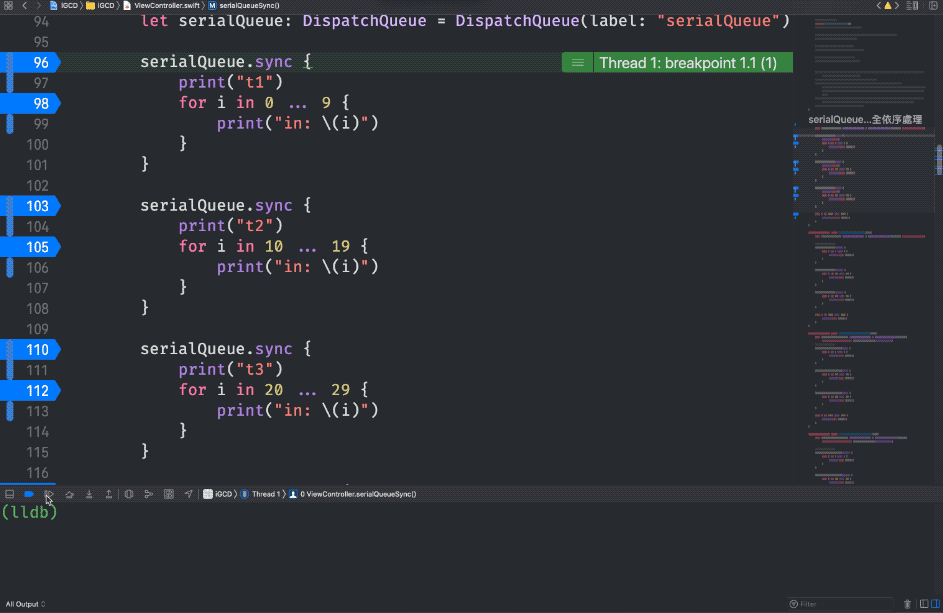

# iOS 多工運作流程與應用

iOS實現多工作業常用方式：
- GCD(Grand Central Dispatch) - 以C語言開發的底層API
- Operation - 將task封裝成Operation物件，再將operation放到OperationQueue中，再依狀況取出task執行

---

## GCD
> Dispatch queues are thread-safe which means that you can access them from multiple threads simultaneously

### Concurrency(平行) vs Parallelism(並行)

圖片來源：[https://www.raywenderlich.com/5370-grand-central-dispatch-tutorial-for-swift-4-part-1-2](https://www.raywenderlich.com/5370-grand-central-dispatch-tutorial-for-swift-4-part-1-2)

- Concurrency：透過作業系統schdule，利用時間差執行task
- Parallelism：同時執行task
> Note that GCD decides how much parallelism it requires based on the system and available system resources. It’s important to note that parallelism requires concurrency, but concurrency does not guarantee parallelism

### Queue種類
- main: Serial Queue
- global: Concurrent Queue
- custom: 自行建立與管理，開發者依需求自行決定Serial Queue或Concurrent Queue 

### queue的執行順序
- GCD直接調用c的api
  1. DISPATCH_QUEUE_PRIORITY_HIGH
  2. DISPATCH_QUEUE_PRIORITY_DEFAULT
  3. DISPATCH_QUEUE_PRIORITY_LOW 
  4. DISPATCH_QUEUE_PRIORITY_BACKGROUND
      
          dispatch_get_global_queue(DISPATCH_QUEUE_PRIORITY_DEFAULT, 0)

- 現行Swift透過quality of service(qos)決定執行順位
  1. userInteractive → main
  2. userInitiated → global.high
  3. default → global.default
  4. utility → global.low
  5. background → global.background
  6. unspecified → global.background
          
          DispatchQueue(label: "xxx", qos: .background)

### serial vs concurrent
- serial：一次只能執行一個task，可知執行順序

- concurrent：一次可以執行多個task，無法預測執行順序

### sync(同步) vs async(非同步) - 將task放入Work Queue後如何處理這個task
- sync
  - 等待task執行完成後才離開
  - blocking(阻塞)，結束前程式不會往下執行

- async
  - task放入work queue後就離開
  - not blocking(不阻塞)，不等待task直接往下執行程式

### 範例
- Serial Queue with Sync
  - 範例程式: **testOperationQueue**
  - 流程圖
  
  - 中斷點驗證
  

- Coucurecy Queue with Sync

- Serial Queue with Async
- Coucurecy Queue with Async
- DispatchGruop
- DispatchSemaphore

### Thread Safe
> Thread safe code can be safely called from multiple threads or concurrent tasks without causing any problems such as data corruption or app crashes

- 需考慮Thread Safety狀況
  1. 靜態變數初始化 
     - 必須保證atomic
     - Singleton
       - objc：使用gcd來確保atomic，在gcd以前會使用NSLock

              // NSLock
              + (void)initialize {
                  initLock = [[NSLock alloc] init];
              }            
              - (instancetype)init {
                  [initLock lock];
                  if (initialized) {
                      [self doesNotRecognizeSelector:_cmd];
                      return nil;
                  }
                  initialized = YES;
                  [initLock unlock];
                  self = [super init];
                  return self;
              }

              // GCD
              +(instancetype)sharedInstance{    
                  static dispatch_once_t onceToken;
                  dispatch_once(&onceToken, ^{
                      instance = [[super allocWithZone:NULL] init];
                  });
                  return instance;
              }

       - swift：golbal變數採用lazy initializer，在第一次被存取時，會自行調用dispatch_once以確保物件atomic，所以不用特別處理。

              static let sharedInstance = SomeObject()

  2. 不同執行緒操作同一物件
     - 該物件unthread safe
       - ex:collection types like Array and Dictionary
     - 物件為mutable
     - 解決方式：使用GCD來解決
       1. Serial Queue
       2. concurrent queue + barriers flag
     - 範例程式: **testOperationQueue**

### 結論
- 非必要不使用sync：雖然是交由其它thread來處理，但還是要等工作做完才可以往下，那不如留在原本的thread處理即可

---
## Operation + OperationQueue
> Operations are an object-oriented way to encapsulate work that you want to perform asynchronously. Operations are designed to be used either in conjunction with an operation queue or by themselves

- 可依需求隨時取消或中斷執行的作業
- 重新封裝，寫法較優雅
- 僅能以concurrent運作
  - 可以設定task間的dependency達到serial效果
- task執行後就被移除
- Operation 
  - 抽象類別，必須實作這個類別才可以放入OperationQueue
  - 加入的task以sync方式執行
    - 想要達到async效果就必須切成多個Operation放入OperationQueue，由OperationQueue取出執行
  - Cocoa/Cocoa Touch Framework已實作兩個Operation子類別，讓開發人員可以自行使用
    - BlockOperation：可以建立一個或多個block, 當全部Black的都執行完才視為任務完成
    - InvocationOperation：可用於執行指定對象的選擇器(Selector)，swift無此類別

          let operationQueue = OperationQueue()
          let blockOperation = BlockOperation()
          blockOperation.addExecutionBlock {
              // something...
          }
          operationQueue.addOperation(blockOperation)
- 範例程式: **testOperationQueue**
---
## 參考資料
  - [Swift 3學習指南：重新認識GCD應用](https://www.appcoda.com.tw/grand-central-dispatch/)
  - [Swift - GCD 多執行緒的說明與應用](https://medium.com/@mikru168/ios-gcd多執行緒的說明與應用-c69a68d01da1)
  - [Grand Central Dispatch Tutorial for Swift 4: Part 1/2
  ](https://www.raywenderlich.com/5370-grand-central-dispatch-tutorial-for-swift-4-part-1-2)
  - [Concurrency in Swift (Grand Central Dispatch Part 1)](https://medium.com/@aliakhtar_16369/concurrency-in-swift-grand-central-dispatch-part-1-945ff05e8863)
  - [GCD和Operation/OperationQueue 看这一篇文章就够了 - Zhihui Tang - Medium](https://medium.com/@crafttang/gcd和operation-operationqueue-看这一篇文章就够了-f38d50521543)
  - [NSOpertation 與 NSOperationQueue](https://zonble.gitbooks.io/kkbox-ios-dev/threading/nsoperation_and_nsoperationqueue.html)
  - [iOS 並行程式設計: 初探 NSOperation 和 Dispatch Queues](https://www.appcoda.com.tw/ios-concurrency/)
  - [Concurrency in Swift (Operations and Operation Queue Part 3)](https://medium.com/@aliakhtar_16369/concurrency-in-swift-operations-and-operation-queue-part-3-a108fbe27d61)
  - [Files and Initialization](https://developer.apple.com/swift/blog/?id=7)